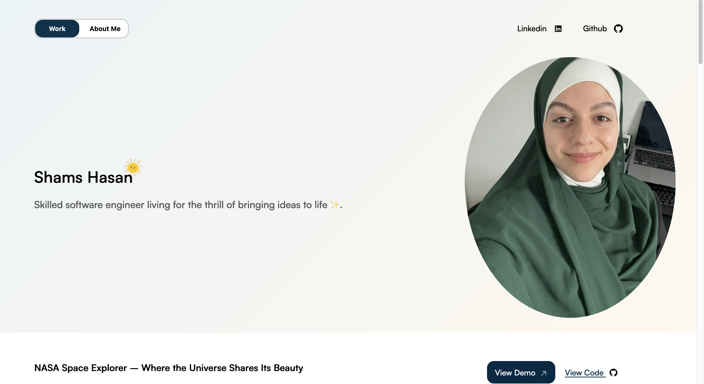

# Portfolio Website

This is the codebase for my personal portfolio website, built with **Angular** for a clean, component-driven architecture.

🎨 **Original Design**: [Oscar Hernandez](https://github.com/OscarViquez)  
💻 **Development**: [Shams Hasan](https://github.com/shamsytech)

This project was a collaboration — Oscar created the visual design and overall aesthetic, and I handled all frontend development, component implementation, and content integration.

## 🛠 What I Built

I translated the design into a structured, maintainable Angular application with reusable components and responsive navigation. I also took creative ownership of specific sections:

### ✨ Wizard101 Collection (Footer)
- Implemented this personal touch
- Built with semantic HTML and minimal CSS

### 🔗 Navigation & View Toggling
- Developed the **navbar** with links to "Work" and "About Me"
- Social links appear in the navbar (desktop) and hero section (mobile), with visibility managed via CSS media queries

## 📁 Component Structure

- `home/` – Main `HomeComponent` and container for all sub-components
- `navbar/` – Navigation bar with links to "Work" and "About Me", plus social media icons (shown on desktop)
- `about/` – "About Me" section featuring a heading, paragraph(s), and profile image
- `hero-section/` – Hero/profile area with name, description, image, and social media links (shown on mobile)
- `project/` – Reusable component for displaying individual projects using dynamic inputs
- `skills/` – Skills section organized into responsive columns
- `footer/` – Footer with fun, personal images (including the Wizard101 Collection)

## 🚀 Built With

- **Angular 16** (with CLI 16.2.16)
- CSS (desktop-first layout; mobile improvements coming soon)
- Semantic, accessible HTML
- No external UI libraries or frameworks
- Deployed via [Vercel](https://shamsytech.vercel.app/)

*My portfolio in action — a clean, personal space built with Angular.*
